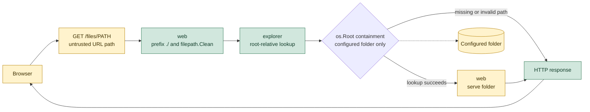

# Context

# Container

The main package is allowed to access the other packages so it can create and initialize them.
The Mermaid C4 diagrams lack styling, which can make links harder to read.

# Dynamic diagrams

## Listing folders

The web layer receives an untrusted path value from the request. It normalizes
that value and passes it to `filesystem`, which is the security boundary for
filesystem access. `filesystem` is created with `os.OpenRoot`, so lookups are
relative to the configured folder and cannot escape that root. Only after the
lookup succeeds does the web layer render a folder response.

This should be a C4 Dynamic diagram, but Mermaid support is not quite there yet.

The yellow blocks mark parts of the system where untrusted content may appear
and must be handled carefully, such as URL encoding or correcting MIME types
before content is served to a user.

