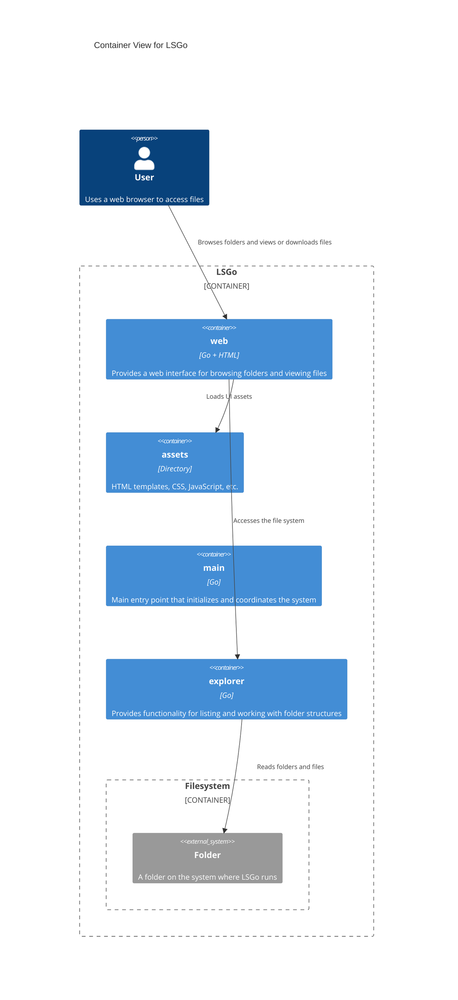

# Context

# Container

The main package is allowed to access all other packages to create and initialize them.
The Mermaid C4 diagrams lack styling, which can lead to readability problems when links are present.

