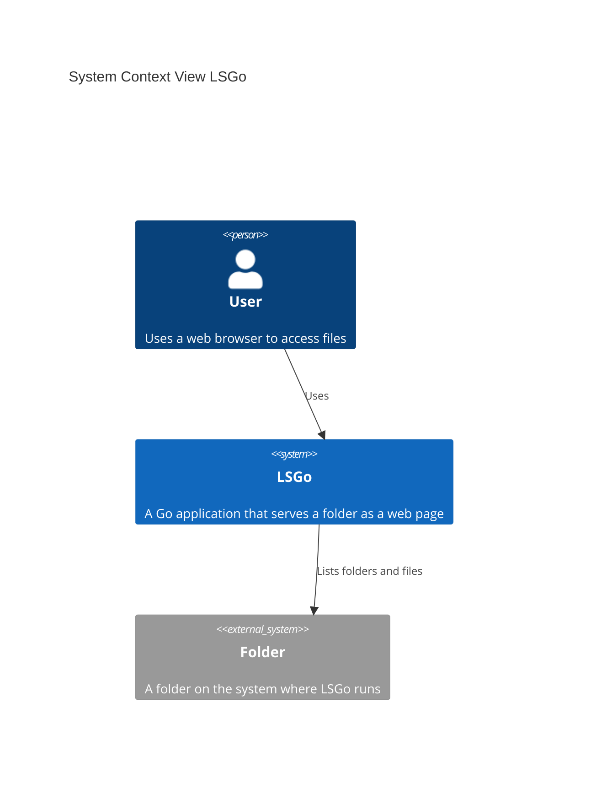
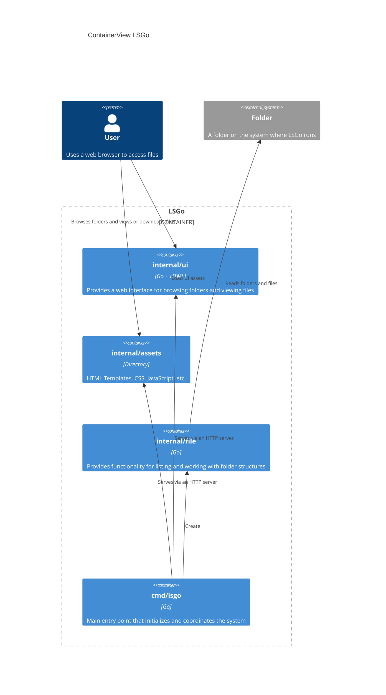

# Context

```mermaid
C4Context
    title System Context View LSGo 
    Person(user, "User", "Uses a web browser to access files")
    System(lsgo, "LSGo", "A Go application that serves a folder as a web page")
    System_Ext(folder, "Folder", "A folder on the system where LSGo runs")
    
    Rel(user, lsgo, "Uses")
    Rel(lsgo, folder, "Lists folders and files")

    UpdateLayoutConfig($c4ShapeInRow="1", $c4BoundaryInRow="1")
```

# Container

```mermaid
C4Container
    title ContainerView LSGo 
    
    Person(user, "User", "Uses a web browser to access files")
    
    System_Ext(folder, "Folder", "A folder on the system where LSGo runs")
    
    Container_Boundary(lsgo, "LSGo") {
        
        Container(uiPkg, "internal/ui", "Go + HTML", "Provides a web interface for browsing folders and viewing files")
        Container(assetsPkg, "internal/assets", "Directory", "HTML Templates, CSS, JavaScript, etc.")
        Container(filePkg, "internal/file", "Go", "Provides functionality for listing and working with folder structures")
        Component(empty,"helper because Mermaid does not have real styling yet")  
        Container(cmdClient, "cmd/lsgo", "Go", "Main entry point that initializes and coordinates the system")
    }

    Rel(user, uiPkg, "Browses folders and views or downloads files")
    Rel(user, assetsPkg, "Load UI assets")

    Rel(filePkg, folder, "Reads folders and files")

    Rel(cmdClient, filePkg, "Create")
    Rel(cmdClient, uiPkg, "Serves via an HTTP server")
    Rel(cmdClient, assetsPkg, "Serves via an HTTP server")

    UpdateLayoutConfig($c4ShapeInRow="3", $c4BoundaryInRow="1")
    UpdateElementStyle(empty, $fontColor="rgba(0,0,0,0)", $bgColor="rgba(0,0,0,0)", $borderColor="rgba(0,0,0,0)")
    UpdateRelStyle(user, uiPkg, $offsetY="40", $offsetX="-200")
    UpdateRelStyle(user, assetsPkg, $offsetY="70", $offsetX="100")
```
